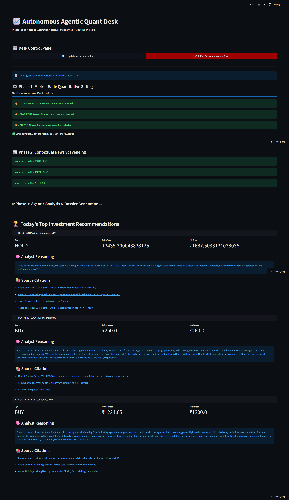

# **📈 Autonomous Agentic Quant Desk**

The Autonomous Agentic Quant Desk is an end-to-end, multi-agent algorithmic trading research pipeline. It actively scans the National Stock Exchange (NSE) of India, mathematically filters 2,000+ stocks for breakout momentum, scrapes real-time financial news, and utilizes a LangGraph-powered AI Agent to generate structured, strictly validated investment dossiers.

## **The Pipeline Architecture**

### **Phase 1: Market-Wide Quantitative Sifting**

- Dynamically downloads the live master list of all 2,000+ traded equities on the NSE.
- Methodically scans stocks using a high-pass filter.
- Calculates **200-day Exponential Moving Averages (EMA)** and rolling **20-day Volume Z-Scores** to mathematically isolate highly anomalous breakout candidates.

### **Phase 2: Contextual News Scavenging (RAG)**

- Bypasses traditional scraping blockers to fetch real-time news via RSS.
- Uses SentenceTransformers (all-MiniLM-L6-v2) to vectorize the financial context.
- Stores the data in a **Supabase pgvector** database, creating a deeply searchable historical vault for the AI.

### **Phase 3: Agentic Analysis (LangGraph)**

- A multi-node AI workflow featuring a **Researcher Agent** (database querying) and a **Lead Analyst Agent** (reasoning).
- Powered by llama-3.3-70b-versatile via **Groq** for lightning-fast inference.
- Utilizes strict Pydantic schemas, payload truncation, and URL decoupling to protect token limits and mathematically guarantee flawless JSON output.

### **Phase 4: Control Panel Dashboard**

- Built on **Streamlit**, featuring memory-managed sequential scanning (100 stocks at a time) and uncorrupted, cleanly mapped markdown citations.

<a href="https://shotockmarket.streamlit.app/">
  
</a>

## **Future Roadmap & Additions**

This project is continuously evolving. Planned upgrades include:

1. **Deep RAG & FinBERT Integration:** Transitioning the embedding model to FinBERT for native understanding of financial jargon, and expanding the scraper to index quarterly earnings call transcripts.
2. **Advanced Quant Math:** Upgrading the sifter.py engine to include RSI (Relative Strength Index), MACD, and Bollinger Bands for tighter momentum confirmation.
3. **Fundamental Data Integration:** Pulling P/E Ratios, Debt-to-Equity, and Revenue Growth metrics to combine technical breakouts with underlying company health.
4. **Multi-Agent Debate Protocol:** Expanding the LangGraph architecture to include a "Bull Agent" and a "Bear Agent" that actively debate the stock before a "Portfolio Manager Agent" makes the final call.
5. **Backtesting Engine:** Developing a standalone Python script to run historical data through the Sifter logic to empirically prove the algorithm's win rate and ROI over a multi-year period.

## **The Stack**

- **Frontend/UI:** Streamlit, Pandas
- **Quantitative Engine:** yfinance, FastAPI
- **AI & Orchestration:** LangChain, LangGraph, Groq API (Llama 3.3 70B)
- **Database & RAG:** Supabase (PostgreSQL \+ pgvector), SentenceTransformers

## **Local Setup**

1. Clone the repository.
2. Install dependencies: `pip install \-r requirements.txt`
3. Create a ` .env` file with your API keys:

```sh
   SUPABASE_URL=your_supabase_url
   SUPABASE_KEY=your_supabase_key
   GROQ_API_KEY=your_groq_api_key
```

4. Run the dashboard: `sh streamlit run dashboard.py`

## **⚠️ Disclaimer**

_This project is for educational and portfolio purposes only. The outputs generated by the AI are not financial advice. Always conduct your own due diligence before making investment decisions._
